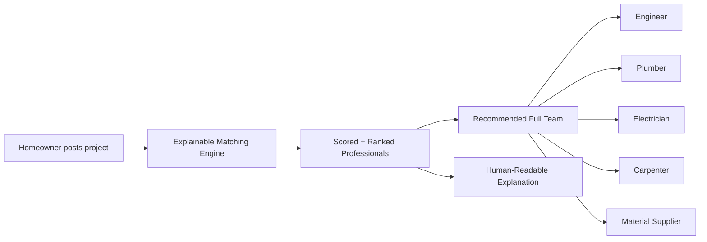
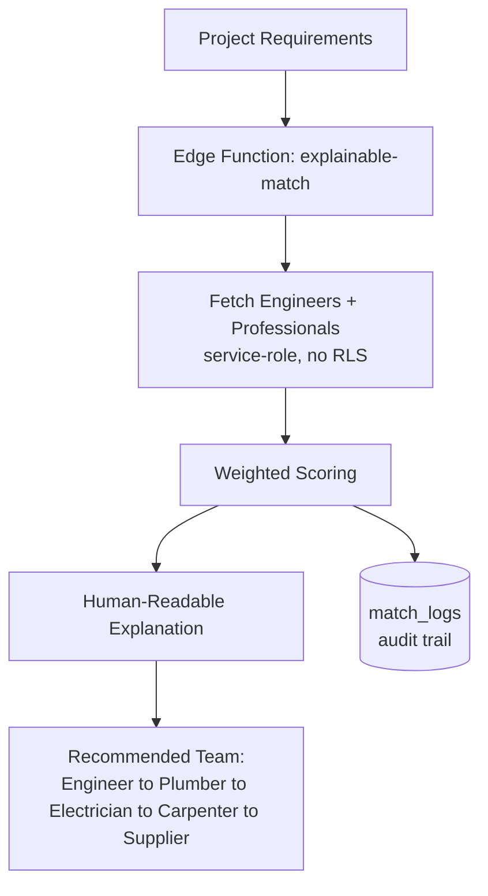
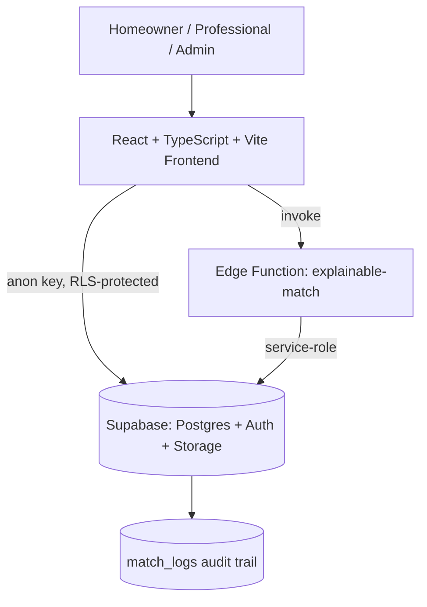
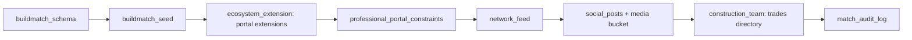
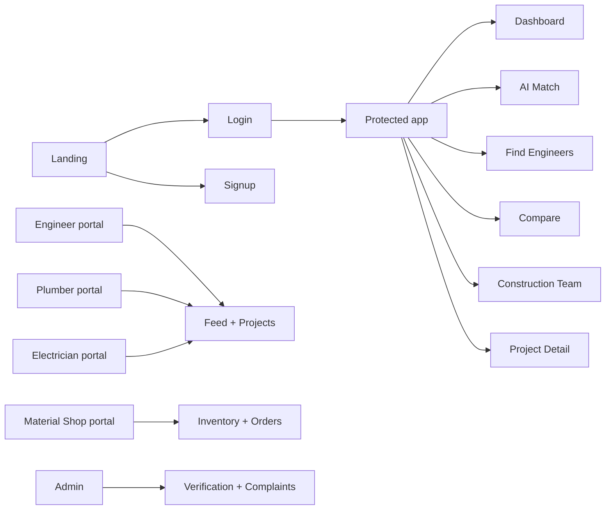
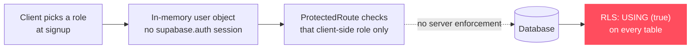

<p align="center">
  
</p>

<p align="center">
  
  
  
</p>

<p align="center">
  AI-powered construction platform connecting homeowners with verified engineers, plumbers, electricians, material suppliers, and other construction professionals — with every match explained, not just scored.
</p>

<p align="center">
  <a href="#-quick-start">Quick Start</a> •
  <a href="#-feature-map">Features</a> •
  <a href="#-explainable-matching-engine">Matching Engine</a> •
  <a href="#-architecture">Architecture</a> •
  <a href="#-database">Database</a> •
  <a href="#-project-structure">Structure</a> •
  <a href="#-known-limitations">Limitations</a> •
  <a href="#-roadmap">Roadmap</a>
</p>

---

## 🏗️ Overview

**BuildMatch AI** replaces the usual "browse a directory and hope" approach to hiring construction professionals with a transparent, explainable matching layer.

Homeowners describe a project once. The platform scores every engineer, plumber, electrician, carpenter, and material supplier against that project — and shows **why** each one was recommended, not just a star rating.



---

## 👥 Who Uses It

| Role | What they get |
|---|---|
| 🏠 **Homeowner** | Dashboard, AI Match, Find/Compare Engineers, Construction Team directory, Digital Passport, Project Team Center, Document Vault, Payments, Reviews |
| 👷 **Engineer** | LinkedIn-style network feed, active projects, project evidence & AI verification, client management |
| 🔧 **Plumber / Electrician** | Professional portal — requests, projects, clients, earnings, verification, subscription |
| 🏬 **Material Shop** | Everything above, plus inventory and orders management |
| 🛡️ **Admin** | Verification approvals, complaints, platform oversight |

---

## ⚡ Feature Map

<table>
<tr>
<td width="50%" valign="top">

### 🏠 Homeowner Portal
- Dashboard with project overview
- **AI Match** — explainable recommendations
- Find & Compare Engineers side-by-side
- **Construction Team** — 9-trade directory with AI matching
- Project Team Center + evidence transparency reports
- Digital Passport, Document Vault, Payments, Reviews

</td>
<td width="50%" valign="top">

### 👷 Engineer / Professional Portals
- Social feed — posts, media, hashtags, mentions, reposts, saves
- Active projects & client management
- Project evidence & AI verification
- Earnings, verification, subscription management
- Shop-specific: inventory + order management

</td>
</tr>
</table>

<details>
<summary><strong>🛡️ Admin & Platform</strong></summary>

- Verification approvals for professionals
- Complaint handling
- Platform-wide oversight dashboard

</details>

<details>
<summary><strong>🔐 Auth</strong></summary>

- Supabase email authentication
- Role-based demo logins (homeowner, engineer, plumber, electrician, material shop, admin)
- Protected routes per role via `<ProtectedRoute roles={[...]}>`

</details>

---

## 🧠 Explainable Matching Engine

The core differentiator: matching runs as a **Supabase Edge Function** (`explainable-match`) that scores every professional with transparent, weighted factors — and generates a plain-language reason for each score instead of a black-box number.



<details>
<summary><strong>📊 Scoring factors — Engineers</strong></summary>

| Factor | Weight | Measures |
|---|:---:|---|
| Budget Fit | 25% | Does pricing fit the homeowner's budget? |
| Location | 20% | Same city/region as the project |
| Experience | 15% | Years of experience + completed projects |
| Specialization | 15% | Match to required house type/style |
| Past Performance | 15% | On-time %, budget adherence %, quality score |
| Timeline Fit | 10% | Availability for the expected timeline |

</details>

<details>
<summary><strong>📊 Scoring factors — Other Professionals</strong></summary>

| Factor | Weight | Measures |
|---|:---:|---|
| Location / Service Area | 25% | Service area coverage |
| Experience | 20% | Years + completed projects |
| Specialization | 20% | Skills match to project needs |
| Reputation | 15% | Verified ratings + reviews |
| Availability | 10% | Current availability status |
| Verification | 10% | Identity + credential verification |

</details>

> Every factor also carries a **confidence level** (high / medium / low) based on how much real data is available — missing fields produce explicit *"Not enough data"* reasons instead of fabricated scores.

**Graceful fallback:** the frontend calls the Edge Function when it's deployed, and automatically falls back to local computation when it isn't — so the app works before you deploy the function.

```bash
# Local dev
cd backend && supabase start
supabase functions serve explainable-match

# Production
cd backend && supabase functions deploy explainable-match
```

---

## 🏛️ Architecture



There is **no custom API server** — the frontend talks to Supabase directly with the public anon key, and Row Level Security enforces what each role can see and change. The Edge Function is the one piece that runs with elevated (service-role) access, purely for unrestricted scoring.

---

## 🗄️ Database

Schema lives entirely in `backend/supabase-migrations/`, applied **in filename order** — every migration is additive and never drops or replaces existing tables.



| Migration | Adds |
|---|---|
| `buildmatch_schema` | Core schema (projects, engineers, professionals) |
| `buildmatch_seed` | Seed data |
| `ecosystem_extension` | Professional portal extensions |
| `professional_portal_constraints` | Portal-level constraints |
| `network_feed` | Social feed backbone |
| `social_posts` | Rich posts + media storage bucket |
| `construction_team` | 9-trade construction directory |
| `match_audit_log` | Audit log for every match invocation |

> Only need the core app (projects, engineers, AI match)? The first two migrations are enough — the rest layer on professional portals, the social feed, and the trades directory.

Apply them in **Supabase Dashboard → SQL Editor**, oldest file first. See `backend/README.md` for details.

---

## 🛠️ Technology Stack

**Frontend**


**Backend**


**Deployment**


---

## 📦 Project Structure

```text
buildmatch/
├── frontend/                  # React SPA (Vite) — all UI, routing, Supabase client
│   ├── src/
│   │   ├── components/
│   │   │   ├── team/          # ConstructionTeam, TeamCenter
│   │   │   ├── professional/  # PortalLayout, NotificationsBell
│   │   │   ├── feed/          # FeedPostCard, PostComposer, PostMedia
│   │   │   └── AppLayout.tsx
│   │   ├── lib/                # supabase.ts, portal.ts, compare.tsx
│   │   └── pages/
│   │       ├── portal/         # Engineer/Plumber/Electrician/Shop portal pages
│   │       ├── Dashboard.tsx, AIMatch.tsx, FindEngineers.tsx
│   │       ├── ProjectDetail.tsx, MyProjects.tsx
│   │       ├── DigitalPassport.tsx, DocumentVault.tsx
│   │       └── AdminDashboard.tsx
│   ├── public/                 # Demo profile photos, icons
│   ├── .env                    # VITE_SUPABASE_URL / VITE_SUPABASE_ANON_KEY
│   └── package.json
│
├── backend/                    # Supabase — schema, RLS, Edge Functions
│   ├── supabase-migrations/    # SQL migrations, run in filename order
│   └── supabase/
│       ├── config.toml
│       └── functions/
│           └── explainable-match/index.ts
│
└── README.md
```

---

## ⚙️ Quick Start

```bash
# 1. Frontend
cd frontend
npm install
npm run dev            # → http://localhost:5173

# 2. Backend (first time only)
#    Run every SQL file in backend/supabase-migrations/ in filename order
#    in the Supabase SQL Editor — see backend/README.md
```

Environment variables live in `frontend/.env`:

```bash
VITE_SUPABASE_URL=your_supabase_url
VITE_SUPABASE_ANON_KEY=your_supabase_anon_key
```

> The anon key is public by design in Supabase apps — but in the current build, **RLS policies are set to `USING (true)` for every table** (documented intentionally in the schema migration as a demo-only choice), and auth is a client-side demo login with no real `supabase.auth` session. See [Known Limitations](#-known-limitations) before treating this as production-ready. Never commit a **service-role** key to the frontend regardless.

### Scripts (run inside `frontend/`)

| Command | What it does |
|---|---|
| `npm run dev` | Vite dev server with HMR |
| `npm run build` | Type-check + production build to `dist/` |
| `npm run typecheck` | `tsc --noEmit` |
| `npm run lint` | ESLint |
| `npm run preview` | Preview the production build |

---

## 🧭 Routes at a Glance



Each professional portal (`/app/engineer/*`, `/app/plumber/*`, `/app/electrician/*`, `/app/material-shop/*`) is role-gated by `<ProtectedRoute roles={[...]}>` and shares `requests`, `projects`, `clients`, `earnings`, `verification`, `subscription`, and `messages` — with `inventory` and `orders` added only for material shops.

---

## ⚠️ Known Limitations

This is a functioning prototype, not a production-hardened app yet. Two things to fix before any public deployment:



<details>
<summary><strong>🔓 Auth is demo-only, not a real session</strong></summary>

`AuthPage.tsx` never calls `supabase.auth` — sign up/sign in just create a local `AppUser` object with a client-chosen role, and `supabase.ts` sets `persistSession: false`. `ProtectedRoute` only checks that in-memory object, so role gating happens entirely in the browser.

**Fix:** wire real `supabase.auth.signUp` / `signInWithPassword`, store role server-side (e.g. in `app_users` keyed to `auth.uid()`), and drive `ProtectedRoute` off the real session.

</details>

<details>
<summary><strong>🔓 RLS policies are fully open</strong></summary>

Every table's policies are `TO anon, authenticated USING (true) WITH CHECK (true)` — intentional and documented in `buildmatch_schema.sql` for demo purposes, but it means anyone with the public anon key can read/write/delete any row via the Supabase REST API directly, regardless of what the UI shows.

**Fix:** rewrite policies to check `auth.uid()` against ownership — e.g. a homeowner only sees their own `projects`, an engineer only sees projects assigned to them.

</details>

<details>
<summary><strong>🟡 Dependency audit</strong></summary>

`npm audit` currently reports high-severity issues concentrated in the build toolchain (`vite`, `postcss`, `rollup`, and their transitive deps) — not the shipped React runtime. Run `npm audit fix` periodically; a `--force` major bump on `vite`/`rollup` should get a smoke test afterward.

</details>

---

## 🗺️ Roadmap

<details>
<summary><strong>Shipped</strong> ✅</summary>

- [x] Core schema + seed data
- [x] Homeowner dashboard, AI Match, Find/Compare Engineers
- [x] Professional portals (engineer, plumber, electrician, material shop)
- [x] Social feed with rich posts, media, hashtags, mentions
- [x] Construction Team directory (9 trades)
- [x] Explainable Matching Engine as a Supabase Edge Function
- [x] Match audit log

</details>

<details>
<summary><strong>Next</strong></summary>

- [ ] Deeper verification workflows for professionals
- [ ] Expanded evidence/transparency reporting per project
- [ ] Notification delivery beyond in-app bell
- [ ] Formal test coverage around the matching engine

</details>

---

## 🤝 Contributing

```bash
git clone <your-repo-url>
cd buildmatch/frontend
npm install
git checkout -b feature/your-feature
npm run typecheck && npm run lint
git add .
git commit -m "Add your feature"
git push origin feature/your-feature
```

## 📄 License

Add the project's selected open-source license here before public distribution.

---

<p align="center">
  
</p>

<p align="center"><strong>BuildMatch AI — matching people to projects, with the reasoning shown.</strong></p>
